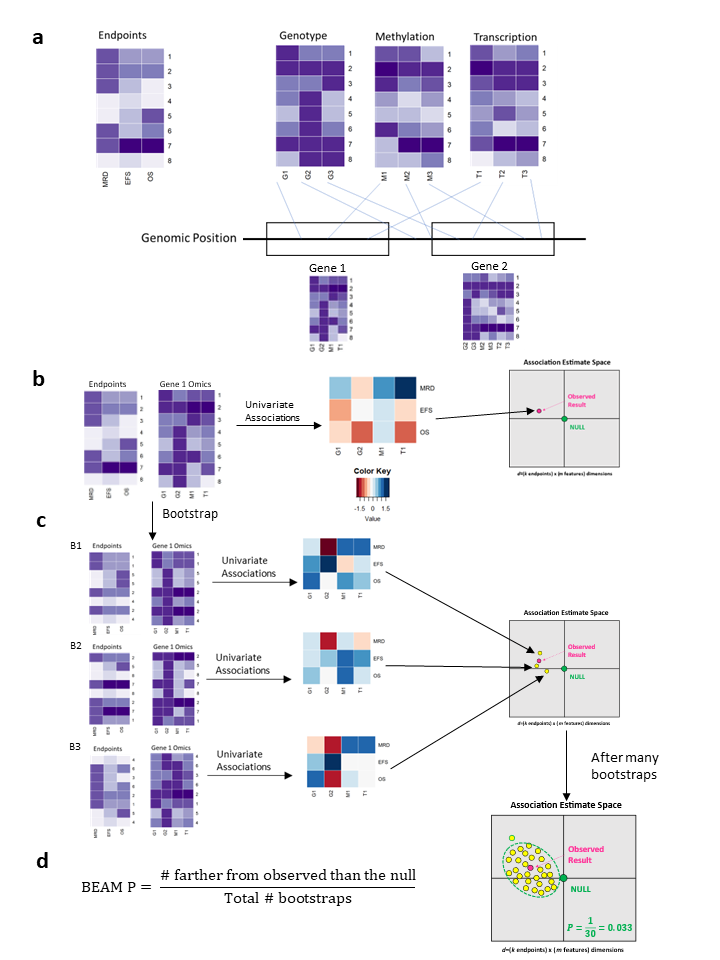

```{r, include = FALSE}
knitr::opts_chunk$set(
  collapse = TRUE,
  comment = "#>"
)
```

```{r setup}
library(BEAMR)
```


## Introduction

Bootstrap Evaluation of Association Matrices (BEAMR) is a method to integrate multiple forms of omics data with multiple clinical endpoints. BEAMR uses simple association models and bootstrapping to provide a consolidated gene ranking using all of the feature/endpoint associations.

Here is a brief overview of BEAMR. First, define sets that link the genomic features from each omic dataset to a "set". This set could be any meaningful grouping of features, such as gene, pathway, etc. Next, for each set, compute the association estimate matrix (AEM), which is a matrix of regression coefficients from univariate association models of each endpoint with each feature in that set. Then we consider the AEM as a point in multivariate association estiamte space and determine its distance from the null point of no association (all entries in the AEM=0). Finally, we use bootstrap resampling to determine if the observed set is significantly different from the null. This is illustrated in Figure 1. 

```{r, fig.align='center', echo=FALSE}

```


In this vignette, we describe how to use the BEAMR package with a pediatric T-ALL example dataset from COG trial AALL0434 published in [Liu et al., 2017](https://www.nature.com/articles/ng.3909). This dataset contains 265 patients, three clinical endpoints, and two omics.

## The Data

The clinical data are saved in $\texttt{clinf}$. The three clinical endpoints are minimal residual disease measured at Day 29 (MRD29), event-free survival (EFS), and overall survival (OS).

```{r}
head(clinf)
```

There are two omics datasets included here. $\texttt{Lesion}$ is an indicator matrix denoting the presence or absence of a lesion. $\texttt{RNA}$ is a matrix of gene expression.

```{r}
omicdat$Lesion[1:5, 1:5]
omicdat$RNA[1:5, 1:5]
```


## Prepare BEAMR Data

To use BEAMR, we need the data in a specific format. This can be accomplished with the `prep_beam_data()` function. In addition to the clinical and omics data, this function also requires omic annotation and set data input. The omics annotation has id and gene columns.

```{r}
head(omicann$Lesion)
head(omicann$RNA)
```

The set data input contains the mapping from the omics features to the sets. It is a data.frame with columns "set.id", "mtx", and "row.id". "set.id" is the name of the set, which is Ensembl ID in this example. "mtx" defines the omic type (e.g., "Lesion" or "RNA"). "row.id" is the feature name, which must be an element of the rownames of the omics matrices.

```{r}
head(setdat)
```


With these components, we can now call `prep_beam_data()`. We also specify the number of bootstrap replicates with the "n.boot" arguement and can set the seed for reproducibility. The output is a beam.data object, which is a list with main.data (clinf), mtx.data (omicdat), mtx.anns (omicann), anns.mtch (summary of omic annotation), set.data (setdat), set.anns, and boot.index (indices of bootstrap resamples).

```{r}
beam.data <- prep_beam_data(main.data=clinf, mtx.data=omicdat,
                            mtx.anns=omicann, set.data=setdat,
                            set.anns=NULL, n.boot=10, seed=123)
```

```{r}
beam.data
```


Before calculating the association estimate matrix, we need to specify the models to fit. We do this through "beam.specs" which can be generated automatically using `prep_beam_specs()`. This function defines the model form based on the endpoint type. The $\texttt{firth=TRUE}$ option uses Firth penalized Cox models which are useful in the presence of rare events or omics. 

```{r}
beam.specs <- prep_beam_specs(beam.data=beam.data, endpts=c("MRD29", "OS", "EFS"), firth=TRUE)
```

```{r}
beam.specs
```

Users may also specify their own models by entering an optional "endptmdl" argument, which is a data.frame with string columns called "endpt" and "mdl".


## Calculate Association Statistics

With the beam.data and beam.specs we can now calculate the association statistics for all omics and all endpoints in the original data and the included bootstrap resamples. This can take a long time depending on the size of your data, and is a natural place to parallelize by computing the statistics for the original data and each bootstrap dataset separately and then recombining. 

```{r, results=FALSE}
beam.stats <- compute_beam_stats(beam.data=beam.data, beam.specs=beam.specs)
```

```{r}
beam.stats
```


## Calculate Set and Feature-Level P-Values

Now we can use the beam.stats to find the set and feature-level p-values.

Set-level p-values: By default, the BEAMR set p-values are for the integration of all available omics and endpoints. The result is a list, and the BEAMR p-values are in the "set.pvals" entry.

```{r}
set.pvals <- compute_set_pvalues(beam.stats)
```

Example of the results:

```{r}
head(set.pvals$set.pvals)
```


The `compute_feature_pvalues()` function returns a list for each omics/endpoint pair with univariate associations for all omics features.

```{r}
feat.pvals <- compute_feature_pvalues(beam.stats)
names(feat.pvals)
```

Example of the results:

```{r}
head(feat.pvals$RNA.EFS)
```


## Subset the Results

If you have large data, the beam.stats result file might be very large, too large to open on a local machine. One option is to filter this results file, which is needed to evaluate the results and plot. The `subset_beam_result()` file allows for filtering based on many different criteria, such as specify a list fo features, a vector of set.ids, a vector of endpoints, a vector of omics, and set or feature-level p/q-value limits. There is an option ot use the intersection or union of all specified criteria. Additionally, the set-level p-values can be optionally recalculated, which should be done if the number of omics or endpoints changes. The example below filters the beam.stats object to the sets with the top ten smallest set-level q-values. 

```{r}
beam.stats.filt <- subset_beam_result(beam.stats, set.pvals, feat.pvals, endpts=NULL,
                                      q.limit=10, intersect=TRUE, recalc=FALSE)
```

```{r}
beam.stats.filt
```


## Plot the Results

Finally, we have some functions to visualize the results. First we need to update "beam.specs" to include a "plot" column. This can be done using the `prep_beam_plot()` function.

```{r}
plot.specs <- prep_beam_plot(beam.data=beam.data, beam.specs=beam.specs)
```

```{r}
plot.specs
```

We can plot the top features (smallest feature-level p-value) for a specified set using the `plot_beam_clin()` function.

```{r, fig.height=7, fig.width=10}
plot_beam_clin(beam.result=beam.stats, beam.specs=plot.specs,
               beam.set.pvals = set.pvals, beam.feat.pvals=feat.pvals,
               set.id="ENSG00000099810", pair.type=NULL, number.pairs=1,
               n.col=3, n.row=NULL)
```

We can also plot all of the clinical endpoint association plots for a specified feature using the `plot_feat_clin()` function.

```{r, fig.height=7, fig.width=10}
plot_feat_clin(beam.result=beam.stats, beam.specs=plot.specs,
               beam.set.pvals=set.pvals, beam.feat.pvals=feat.pvals,
               feat.id="ENSG00000227443_loss", n.col=2, n.row=NULL)
```


